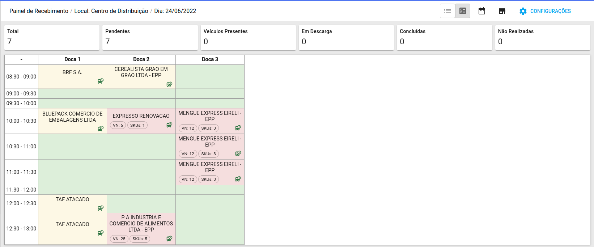

# Teste de front-end TempoCerto

Este teste busca avaliar quesitos técnicos para as pessoas que se candidatem às vagas de desenvolvimento front-end da TempoCerto.

## O desafio

O objetivo é criar uma Single Page Application seguindo o layout a baixo:

## O que sua aplicação deverá fazer

- Listar agendas dentro do grid Horários X Docas

### Sobre o layout

- A interface deve ficar o mais fiel possivel do layout disponibilizado.

## O que será avaliado

- Arquitetura
- Criação de componentes
- Reaproveitamento de código
- Código limpo e organizado (nomenclatura, etc)
- Utilização correta de git
- README.md bem escrito, curto e com os comandos necessários para rodar a aplicação, bastando copiar/colar no terminal.

## Requisitos

- [ReactJS](https://pt-br.reactjs.org/)
- [Material-UI](https://mui.com/pt/material-ui/getting-started/installation/)

