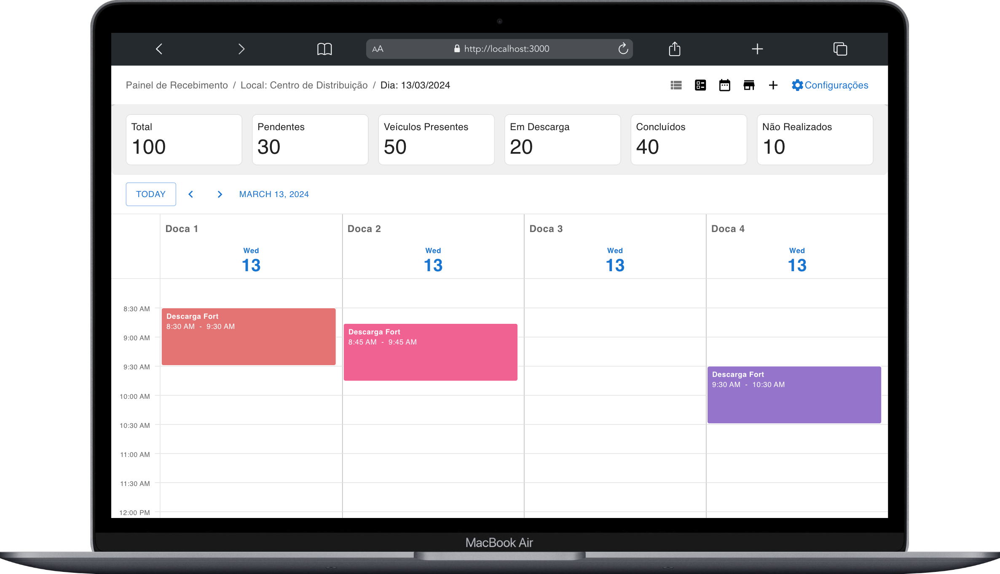

# tempocerto-backend
This project aims to view various schedules in the screen.

## Execution Guide

To run this code, you need to have Makefile and Docker installed on your system.
***You must have ports free to run the APIs***

* 3000 (application), 
* 8080(tempocerto-api)

### Steps for Execution

1. Clone this repository to your local machine.

2. In the terminal, navigate to the project root directory.

3. Run the backend application

4. Import postman file (postman_collection.json) contains in this project and create the company(/v1/company), slots(v1/daily-slots) and after update the schedule(v1/schedule) with informations requirements. Afther step, will possible to view your schedules in the frontend.

5. Run the following command to launch the application:

```bash
   make start-docker-app
```

After executing the above command, the application will be accessible at [http://localhost:3000](http://localhost:3000).


***To use the backend application methods, follow the instructions below:***

1. Open the Postman.
   
2. Import the provided request collection file (postman_collection.json).

3. [Link to insominia documentation and step by step to run](https://documenter.getpostman.com/view/31816718/2sA2xjyqTE)

